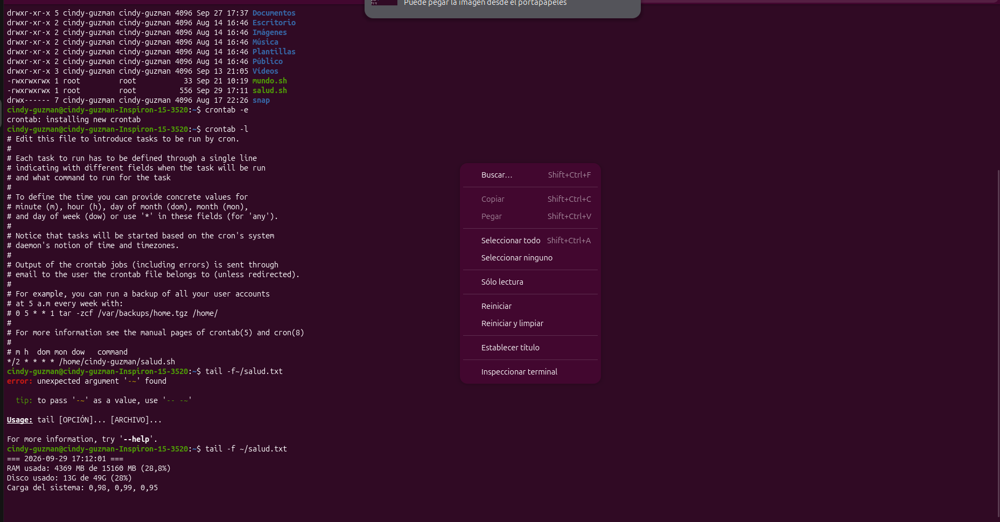
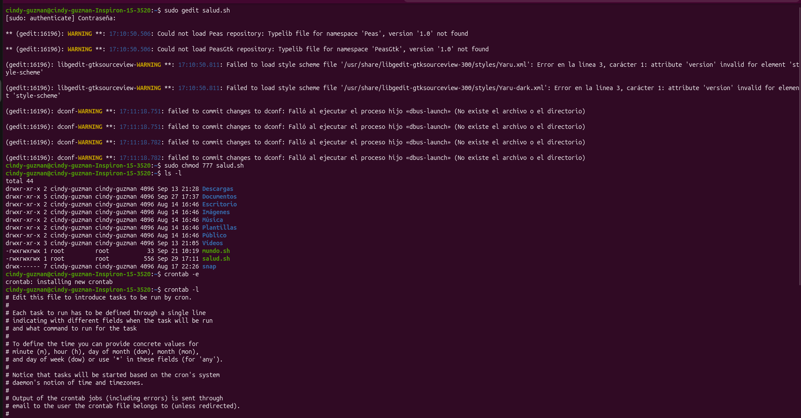

#Nombre del proyecto

 CRONTAB CON SCRIPTS

##Descripcion 
El presente proyecto documenta el diseño, la configuración y el análisis empírico de un mecanismo desatendido de monitoreo para sistemas operativos basados en GNU/Linux. Se implementó un script en Bash (salud.sh) encargado de sondear y registrar de forma periódica el estado de la memoria RAM, el espacio disponible en el sistema de archivos raíz y los promedios de carga de la unidad central de procesamiento (CPU load average). La ejecución cíclica fue delegada al demonio de planificación cron a intervalos regulares de dos minutos. Los resultados observados se contrastan con los fundamentos teóricos de la gestión de memoria virtual, planificación de procesos y seguridad en sistemas de archivos UNIX

##Objetivos

Implementar y evaluar un servicio de recolección continua de métricas de rendimiento del sistema operativo mediante utilidades estándar de Bash y el subsistema de programación de tareas cron, analizando las repercusiones en concurrencia, uso de descriptores y políticas de control de acceso.
Automatización y programación desatendida:
Comprender la semántica, jerarquía y entorno de ejecución del demonio cron y la interfaz de usuario crontab.   Instrumentación y procesamiento de métricas: 
Recolectar datos en tiempo de ejecución empleando utilidades de consulta (free, df, uptime) y procesadores de texto estructurado (awk). 
Seguridad y privilegios en UNIX:
Analizar los efectos de la delegación de permisos binarios (chmod) y los riesgos de escalamiento asociados a la asignación de permisos globales (777) frente al principio de privilegio mínimo.  
Modelado y validación de comportamiento: 
Contrastar la dinámica temporal de los promedios de carga (load average) contra la teoría matemática de filtros exponenciales amortiguados del kernel de Linux.  

##Codigos y Scripts

[Ver comandos](<Código y Scripts/Readme.txt>)

##Reporte
[Ver Reporte](Reporte/C1.pdf)

##Terminal

 

## Video del funcionamiento

[Ver video en YouTube](https://www.youtube.com/watch?v=9QGxKNMjV1U)

